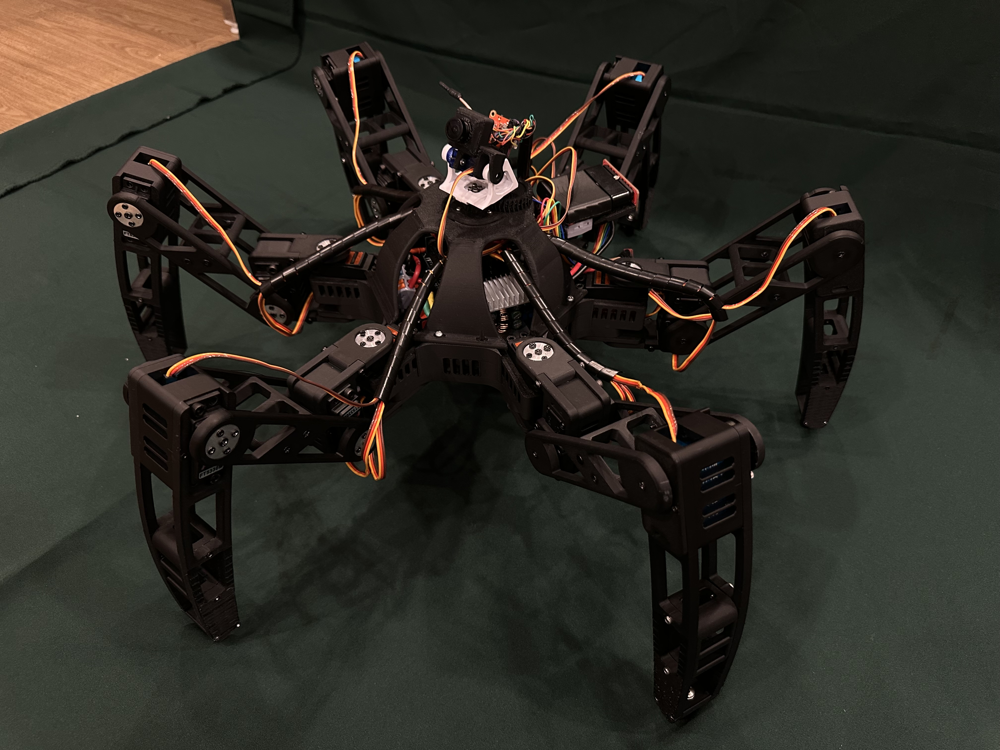
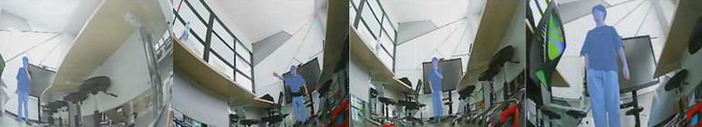

# Hexapod-Robot
2023 IEEE International Conference on Robotics and Biomimetics (ROBIO)

# 🕷️ Autonomous Rescue Hexapod Robot with AI Human Detection

A six-legged robot designed for search-and-rescue missions, capable of navigating rough terrain and detecting humans using AI.

## 📌 Overview

This robot is built for disaster scenarios where humans cannot easily access:
- Earthquakes
- Collapsed buildings
- Hazardous environments

It combines:
- Stable hexapod locomotion
- Real-time vision system
- AI-based human detection

## 🎯 Key Features

- 🦿 Hexapod robot with 18 DOF
- 🎥 FPV camera system
- 🧠 AI human detection (DeepLabV3+)
- 🎯 Target tracking (maintains ~1m distance)
- 🕹️ Manual + Autonomous control modes

## 🤖 Robot Design

### Movement:
- Tripod gait (high stability)
- Optimized for uneven terrain

## 🧠 AI System

- Semantic Segmentation (DeepLabV3+)
- Dataset: CIHP (38k images)
- Accuracy: ~94%

## ⚙️ Tech Stack

| Component | Technology |
|----------|-----------|
| AI Model | DeepLabV3+ |
| Control  | Arduino Mega |
| Vision   | FPV Camera |
| Communication | RF + Bluetooth |

## 🎮 Control System

- Manual mode (joystick)
- Autonomous mode (AI tracking)

## 📸 Demo

### Human Detection

## 🚀 How It Works

1. Camera captures environment
2. AI detects human body parts
3. Compute centroid
4. Send movement command
5. Robot follows target

## 📈 Performance

!

- Stable walking on rough terrain
- Real-time detection
- Smooth tracking behavior

## ⚠️ Limitations

- Requires good camera signal
- Limited range (RF communication)
- Partial detection depends on visibility

## 🔮 Future Work

- Full-body detection
- SLAM navigation
- Autonomous path planning
- Thermal camera integration

## 👨‍💻 Authors

- Pavares Tomaneenilrat
- Team Members (KMITL Robotics & AI Engineering)

## 📄 License

MIT License
